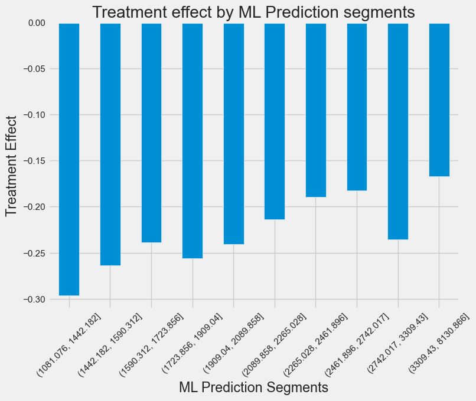

# Causal Inference - Optimize Discount Strategy for E-Commerce Business

This repository is dedicated to applying causal inference techniques to real-world business challenges and is part of APPM 6900 Independent Study in Causal Inference at the University of Colorado, Boulder.

## Business Case
The project focuses on leveraging causal analysis to optimize discounting strategies for an e-commerce businesses, showcasing how to predict the impact of various actions on business outcomes and key performance indicators (KPIs).

The company wishes to use discounts to boost sales and hence, profits. But while discounting does boost sales, in the long run, it has a direct negative impact on profits: whatever you give as a discount you don’t make as earnings. The e-commerce company states that each customer’s profitability is given as follows:

$$
Profits_i = Sales_i * 0.05 - Discount_i
$$

## Techniques

1. [Bias Adjustment Using Linear Regression](1_bias_adjustment.ipynb):
Leveraged linear regression to adjust for bias, improcing the quality and reliablity of the the data analysis.

Before debiasing and denoising

After debiasing and denoising

We see that the customers with high residualized discounts no longer have high sales_prediction_bins. The regression adjustment has made the residual discount seem as good as randomly assigned.

2. [Regression Discontinuity Design](2_rdd.ipynb):
Used regression discontinuity design (RDD) as a form of natural experiment as an alternative to A/B testing. RDD measures treatment effects at points of discontinuity to get an idea of the effectiveness of a program without needing to rigorously A/B test it.

3. [Difference in Differences](3_diff_in_diff.ipynb):
Employed Difference-in-Differences (DiD) methodology to evaluate the impact of policy changes or interventions over time by comparing the differences in outcomes before and after the treatment across treated and control groups.

4. [Synthetic Control](3_diff_in_diff.ipynb)
Utilized the Synthetic Control Method to construct a counterfactual scenario using a weighted combination of control units that closely resemble the treated unit(s) before the intervention.

>> We see the profits for MG decreasing after the intervention which suggests that the effect of discounts on profit is negative.

5. [Double/Debiased Machine Learning](5_double_ml.ipynb)
Implemented Double/Debiased Machine Learning (DML) leveraging LightGBM to control to refine causal estimate. 

## Personalization
Currently, the company is giving discounts to **all** customers, which, on average, is resulting in less profits. However, this is not the only option - we might be able to find subgroups of customers where the causal effect is positive. If we can then give discounts to only those customers, the e-commerce company can still make money by giving discounts. 

A great personalization strategy will find some way to segment the customers in such a way that they respond very differently to the treatment in each segment. The company currently employs a ML model that predicts sales and the company provides discounts based on sales prediction. Our work so far as shows that this has an average negative effect of profits. We check if there are segments with positive treatment effects

**Segmenting customers by the sales prediction model results in no segment where more discount leads to more profit** - the treatment effect is always negative. However, we found $Age$ to have a positive treatment effect in the 40 to 67 segment. 

Finally, our random number segments resulted in treatment effect that varies around the average treatment effect.

The project closely follows the excellent course offered by [Matheus Facure.](https://matheusfacure.github.io)