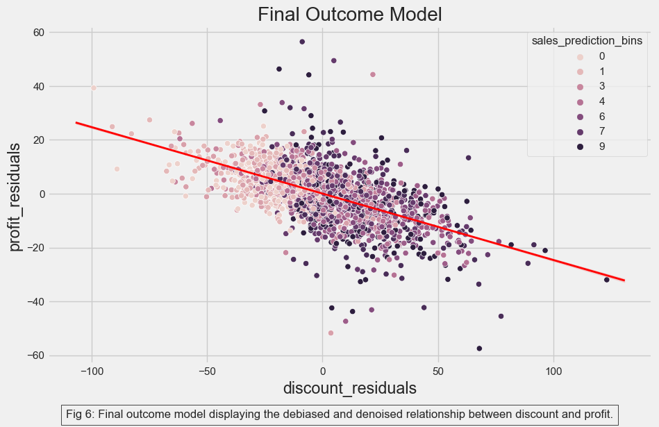

# Causal Inference: Optimizing Discount Strategy for E-Commerce Business

>> This repository focuses on the practical application of causal inference methodologies to address real-world business problems. It is associated with the APPM 6900 Independent Study (in Causal Inference) course, conducted at the University of Colorado, Boulder, under the guidance of [Dr. Brian Zaharatos](https://www.colorado.edu/amath/brian-zaharatos).

## Business Case
The project aims to refine the discount strategy of an e-commerce business through causal analysis. It evaluates how discounts influence sales and profitability by predicting the outcomes of different actions on key metrics.

The company wishes to use discounts to boost sales and hence, profits. But while discounting does boost sales, in the long run, it has a direct negative impact on profits: whatever you give as a discount you don’t make as earnings. The e-commerce company states that each customer’s profitability is given as follows:

$$
Profits_i = Sales_i * 0.05 - Discount_i
$$

A predictive machine learning model estimates future sales, guiding the distribution of discounts to customers. The business has experimented with targeted discounts, such as offering coupons to women on Mother's Day, and has tested increased discount rates in a specific state.

The objective is to determine the actual impact of these discount strategies and provide actionable insights for future initiatives.

## Result
Initial analyses of the e-commerce company's discounting strategy indicated a negative effect on customer profitability. Subsequent refinement through Double/Debiased Machine Learning (DML) method confirmed these findings, revealing a negative coefficient of 0.25 — **implying that each dollar increase in discount leads to a $0.25 decrease in profits**.

To address this, we employed DML to develop a model capable of estimating the heterogeneity in treatment effects or the Conditional Average Treatment Effect (CATE) across customers. This approach enabled us to generate a score that can effectively segment customers based on their predicted responsiveness to discounts.

Analysis of the cumulative elasticity curve, derived from sorting customers by their DML-predicted treatment effect, indicated that targeting the top 63% of customers could yield a positive treatment effect. However, to adopt a more cautious strategy, **we advise that the company offer discounts only to those customers whose treatment effect prediction falls above the 55th percentile**.** This targeted approach is designed to optimize the effectiveness of discounting strategies while safeguarding profit margins.

## Techniques

1. [Bias Adjustment Using Linear Regression](1_bias_adjustment.ipynb):
Leveraged linear regression to adjust for bias, improcing the quality and reliablity of the the data analysis.

Before debiasing and denoising

After debiasing and denoising

We see that the customers with high residualized discounts no longer have high sales_prediction_bins. The regression adjustment has made the residual discount seem as good as randomly assigned.

2. [Regression Discontinuity Design](2_rdd.ipynb):
Used regression discontinuity design (RDD) as a form of natural experiment as an alternative to A/B testing. RDD measures treatment effects at points of discontinuity to get an idea of the effectiveness of a program without needing to rigorously A/B test it.

3. [Difference in Differences](3_diff_in_diff.ipynb):
Employed Difference-in-Differences (DiD) methodology to evaluate the impact of policy changes or interventions over time by comparing the differences in outcomes before and after the treatment across treated and control groups.

4. [Synthetic Control](3_diff_in_diff.ipynb):
Utilized the Synthetic Control Method to construct a counterfactual scenario using a weighted combination of control units that closely resemble the treated unit(s) before the intervention.

5. [Double/Debiased Machine Learning](5_double_ml.ipynb):
Implemented Double/Debiased Machine Learning (DML) leveraging LightGBM to control to refine causal estimate. 

## Initial Findings

## Personalization
The company currently applies discounts across the board, leading to an overall decrease in profits. However, the possibility exists to enhance profitability by identifying customer subgroups that exhibit a positive response to discounts. The goal is to target discounts specifically to these groups to maintain or increase profits. 

We found that Age-based segmentation resulted in a positive impact on profits within the 40 to 67 age group, suggesting targeted discounts could be beneficial here.

### Causal Model for Personalization
The Double/Debiased ML model was used to create a score to segment the customers. We compare its performance against a simple Age based segmentation.

#### Interpretation
While Age is better at distinguishing customers with a high positive treatment effect (age curve starts out above our model's curve), our mode is clearly better to distinguish customers with a low and high treatment effects overall.

The project closely follows the excellent course offered by [Matheus Facure.](https://matheusfacure.github.io)