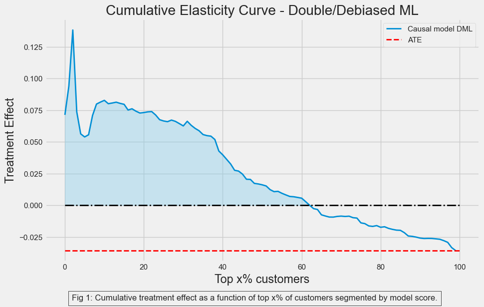
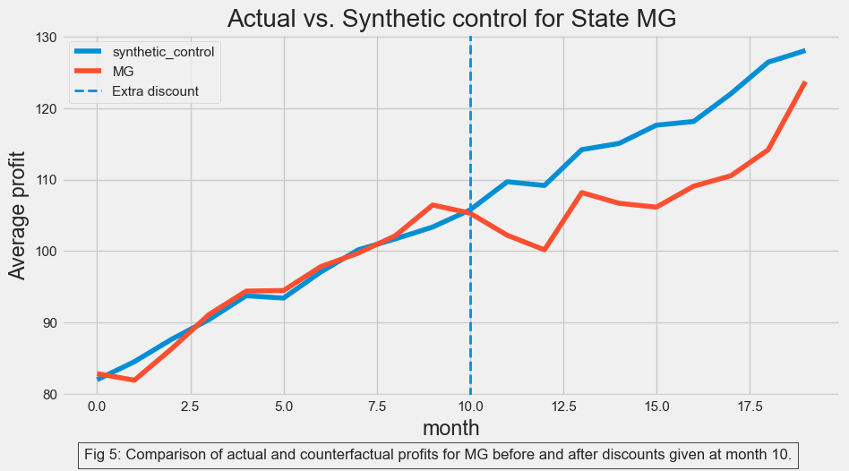

# Causal Inference: Optimizing Discount Strategy for E-Commerce Business

> This repository focuses on the practical application of causal inference methodologies to address real-world business problems. It is associated with the APPM 6900 Independent Study (in Causal Inference) course, conducted at the University of Colorado, Boulder, under the guidance of [Dr. Brian Zaharatos](https://www.colorado.edu/amath/brian-zaharatos).

## Business Case
The project aims to refine the discount strategy of an e-commerce business through causal analysis. It evaluates how discounts influence sales and profitability by predicting the outcomes of different actions on key metrics.

The company wishes to use discounts to boost sales and hence, profits. But while discounting does boost sales, in the long run, it has a direct negative impact on profits: whatever you give as a discount you don’t make as earnings. The e-commerce company states that each customer’s profitability is given as follows:

$$
Profits_i = Sales_i * 0.05 - Discount_i
$$

A predictive machine learning model estimates future sales, guiding the distribution of discounts to customers. The business has experimented with targeted discounts, such as offering coupons to women on Mother's Day, and has tested increased discount rates in a specific state.

The objective is to determine the actual impact of these discount strategies and provide actionable insights for future initiatives.

## Result
Initial analyses of the e-commerce company's discounting strategy indicated a negative effect on customer profitability. Subsequent refinement through Double/Debiased Machine Learning (DML) method confirmed these findings, revealing a negative coefficient of 0.25 — **implying that each dollar increase in discount leads to a $0.25 decrease in profits**.

To address this, we employed DML to develop a model capable of estimating the heterogeneity in treatment effects or the Conditional Average Treatment Effect (CATE) across customers. This approach enabled us to generate a score that can effectively segment customers based on their predicted responsiveness to discounts.

Analysis of the cumulative elasticity curve, derived from sorting customers by their DML-predicted treatment effect, indicated that targeting the top 63% of customers could yield a positive treatment effect. However, to adopt a more cautious strategy, **we advise that the company offer discounts only to those customers whose treatment effect prediction falls above the 55th percentile**.** This targeted approach is designed to optimize the effectiveness of discounting strategies while safeguarding profit margins.

## Techniques

### 1. [Bias Adjustment Using Linear Regression](1_bias_adjustment.ipynb):
Leveraged linear regression to adjust for bias, improving the quality and reliablity of the the data analysis.

We see that the customers with high residualized discounts no longer have high sales_prediction_bins. The regression adjustment has made the residual discount seem as good as randomly assigned.

### 2. [Regression Discontinuity Design](2_rdd.ipynb):
Used regression discontinuity design (RDD) as a form of natural experiment as an alternative to A/B testing. RDD measures treatment effects at points of discontinuity to get an idea of the effectiveness of a program without needing to rigorously A/B test it.

### 3. [Difference in Differences](3_diff_in_diff.ipynb):
Employed Difference-in-Differences (DiD) methodology to evaluate the impact of policy changes or interventions over time by comparing the differences in outcomes before and after the treatment across treated and control groups.

### 4. [Synthetic Control](3_diff_in_diff.ipynb):
Utilized the Synthetic Control Method to construct a counterfactual scenario using a weighted combination of control units that closely resemble the treated unit(s) before the intervention.

### 5. [Double/Debiased Machine Learning](5_double_ml.ipynb):
Implemented Double/Debiased Machine Learning (DML) leveraging LightGBM to control to refine causal estimate. 

## Analysis

Our initial analysis revealed a slight positive correlation between discount rates and profit margins. However, it's critical to note that this correlation does not imply causation, largely due to the presence of a bias term. This bias suggests that customers likely to make larger purchases may receive higher discounts, indicating that the observed correlation might be overestimated. Further, the apparent profit difference between customers receiving high and low discounts could stem from factors other than the discounts themselves, such as age and sales prediction categories, which are not exchangeable.

Our analysis identified age and sales predictions as confounders. Specifically, we observed a positive correlation between age and discount levels, suggesting older customers tend to receive larger discounts. This trend may reflect a causal relationship between age and profit, as older customers could have higher purchasing power, leading to increased sales and profits. Sales prediction is another confounder, with anticipated higher purchase volumes leading to larger discounts.

We also explored data discontinuities related to customer tenure. The e-commerce company's policy of awarding discount bonuses to long-term customers, specifically after 20 months of patronage, presented an opportunity for a regression discontinuity design analysis. This approach revealed a negative treatment effect (TE) of -7.6. Further refinement using kernel weights confirmed the persistence of this negative effect.

Additionally, our analysis covered promotional strategies like discount coupons issued to women on Mother's Day and aggressive discounting tested in the state of MG. Utilizing a difference-in-differences (DiD) analysis, we determined that the Mother's Day discount led to a $-4.77 treatment effect on profits. For the state of MG, constructing a synthetic control to estimate the TE revealed a similar negative impact of discounts on profit. 

## Personalization
Given the observation of a negative average treatment effect from broad discount strategies, our analysis shifted towards the potential for profit enhancement through targeted discounting. The objective was to pinpoint customer segments demonstrating positive responses to discounts, thereby enabling the company to tailor discount strategies to these specific groups to either sustain or boost profitability.

<!-- We found that Age-based segmentation resulted in a positive impact on profits within the 40 to 67 age group, suggesting targeted discounts could be beneficial here.

 -->

### Causal Model for Personalization
Using the Double/Debiased Machine Learning (DML) model, we developed a customer scoring system for segmentation, aiming to identify groups with a positive response to discounts. This method was compared against a simpler, age-based segmentation to assess its effectiveness.

#### Interpretation
The age-based segmentation excelled in identifying customers with a high positive treatment effect, as the age curve initially started higher. However, our model proved better in differentiating between customers with low and high treatment effects across the board. This indicated that, while age served as a strong predictor for identifying high responders, our model offered a broader and more nuanced understanding of customer responses to discounts. Thus, it enabled the ability to tailor discount strategies effectively across a wider customer base.

---

The project closely follows the excellent course offered by [Matheus Facure.](https://matheusfacure.github.io)